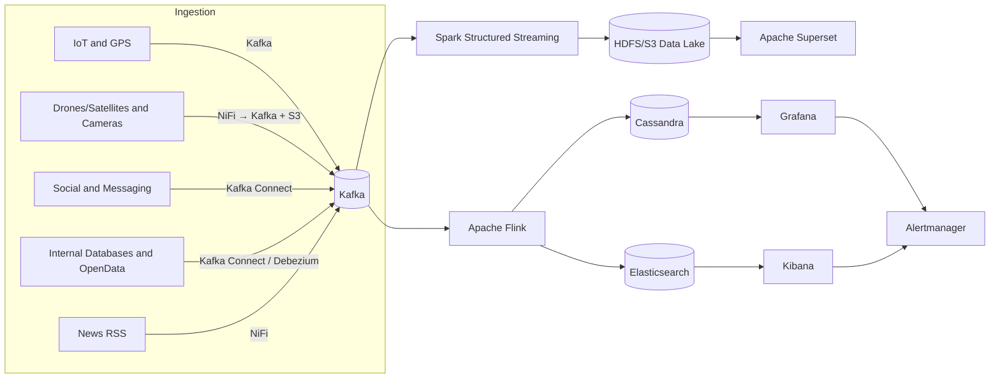

# TP4 Synthse

## Introduction
**Sujet :** Conception d’une architecture Big Data pertinente pour un système de gestion de données en temps réel dans un contexte complexe et exigeant.

**Contexte :** Une grande entreprise de logistique humanitaire internationale souhaite mettre en place une plateforme de gestion de crise en temps réel pour suivre et anticiper les catastrophes naturelles, les mouvements de population et les besoins logistiques sur le terrain.

**Les défis du contexte :**

Les données proviennent de sources multiples, hétérogènes et massives Les données sont structurées, semi-structurées et non-structurées Il est essentiel de disposer d’une vision temps réel pour réagir rapidement Le système doit être scalable, tolérant aux pannes, sécurisé et évolutif.

**Objectifs de la veille :**

Recenser les technologies de stockage des données, traitement des données en temps réel et visualisation.

Comprendre avantages, inconvénients et cas d’usage de chaque outil.

Comparer les approches architecturales (Lambda, Kappa, event‑driven).

Proposer une architecture Big Data pertinente et justifier les choix techniques.

## Méthodologie
Sources consultées :

Blogs officiels : Confluent, Databricks, Cloudera

Plateformes techniques : Medium (KDnuggets), InfoQ

Conférences et webinaires : Strata Data Conference, Big Data Paris

Newsletters : Newsletter Données et IA, Apache Weekly

## Outils de veille :

Alertes Google (mots-clés : « Big Data en temps réel », « traitement de flux »)

Feedly pour agrégation RSS

Veille collaborative via document partagé (Google Docs)

Période : Du 01/04/2025 au 14/04/2025

## Résumé des informations collectées
1. Stockage
HDFS (système de fichiers distribué Hadoop)

Avantages : Scalable, tolérance aux pannes.

Inconvénients : Latence pour petits fichiers, administration lourde.

Cas d’usage : Archives de logs, data lake historique.

Apache Cassandra

Avantages : Très haute disponibilité, écriture rapide.

Inconvénients : Cohérence éventuelle, requêtes secondaires limitées.

Cas d’usage : Séries temporelles, IoT, journaux d’événements.

MongoDB

Avantages : Schéma flexible, requêtes ad hoc.

Inconvénients : Moins performant en très haut débit, coût mémoire.

Cas d’usage : Stockage de documents JSON, profils utilisateurs.

2. Traitement temps réel
Apache Kafka

Avantages : Très haut débit, durabilité, replay de flux.

Inconvénients : Configuration et partitionnement complexes.

Cas d’usage : Bus d’événements, ingestion centralisée.

Diffusion en continu d'Apache Spark

Avantages : API unifiée batch/stream, tolérance via micro-batch.

Inconvénients : Latence de l’ordre de la seconde, overhead scheduler.

Cas d’usage : Agrégations near-real-time, enrichissements.

Apache Flink

Avantages : True streaming, latence <100ms, gestion d’état avancée.

Inconvénients : Courbe d’apprentissage, configuration du state backend.

Cas d’usage : Détection d’anomalies, analyses complexes avec fenêtres.

3. Visualisation
Grafana

Avantages : Support multi-sources (Prometheus, InfluxDB…), alerting intégré.

Inconvénients : Nécessite base time-series externe.

Cas d’usage : Monitoring métriques, dashboards infra.

Kibana

Avantages : Recherche textuelle Elasticsearch, dashboards logs.

Inconvénients : Scalabilité dépendante d’Elasticsearch, RAM élevée.

Cas d’usage : Exploration de logs, analyses opérationnelles.

Sur-ensemble Apache

Avantages : BI légère, support SQL natif.

Inconvénients : Moins adapté au temps réel, UI parfois lente.

Cas d’usage : Reporting métier, exploration ad hoc.

4. Architectures comparées
Architecture	Latence	Scalabilité	Complexité	Entretien	Coûts
Lambda	Lot + Streaming	Haute (lot)	Très élevée (double)	Complexe	Élevés
Kappa	Diffusion en continu uniquement	Très haute	Moyenne	Moyenne	Modérés
piloté par les événements	En temps quasi réel	Variable selon broker	Moyenne	Variable	Selon scale
Analyse personnelle
Tendance dominante : Passage à des architectures Kappa full-streaming pour simplifier et réduire la dette technique.

Critères clés :

Latence : besoin <1s → Flink sur Kappa.

Scalabilité : Kafka + Flink / Spark managé.

Complexité & Maintenance : Lambda élimine la redondance, Kappa plus simple mais exige un broker solide.

Coûts : cloud managé (Confluent Cloud, AWS MSK) vs on-premise.

- Proposition d’architecture adaptée au contexte humanitaire :
Sources de données & ingestion :

Capteurs IoT & GPS (température, humidité, qualité de l’air, positions véhicules) → ingestion via Apache Kafka (topics dédiés)

Images & vidéos (drones, satellites, caméras) → ingestion RTMP/HTTP vers Kafka Connect + stockage objets (HDFS/S3)

Flux réseaux sociaux & messageries (Twitter, Facebook, WhatsApp, Telegram) → pipeline Kafka Connect / NiFi pour ingestion JSON

Bases internes & OpenData (gestions stocks, météo, cartographie) → ingestion batch/CDC via Kafka Connect et Debezium d’architecture

News RSS & agences de presse → ingestion via Apache NiFi dans Kafka

Traitement & analyses en temps réel :

Apache Flink pour true-stream processing : enrichissements, agrégations géospatiales, détection d’anomalies (CEP)

Spark Structured Streaming pour micro-batch : jointures historiques, ML / scoring en near-real-time

Stockage et indexing :

HDFS / Object Storage (S3) pour data lake historique, images et vidéos

Apache Cassandra pour séries temporelles IoT et données GPS

Elasticsearch pour indexation des logs, textes et recherche full-text

PostGIS / GeoMesa pour stockage et requêtes géospatiales

Orchestration et DataOps :

Apache Airflow pour workflows batch (OpenData, traitements lourds)

CI/CD DataOps (Git, Docker, Helm) pour déploiement et versioning des jobs Flink/Spark

Visualisation et alerte :

Grafana pour métriques (connecteurs Cassandra, Prometheus)

Kibana pour l'exploration des journaux/messages (Elasticsearch)

Apache Superset pour rapports analytiques multi-sources

Alertes via Grafana Alertmanager (Slack, email, SMS)

Sécurité & gouvernance :

Apache Ranger / AWS IAM pour gestion des accès

Chiffrement au repos (KMS) et en transit (TLS)

Anonymisation et masquage des informations personnelles via les processeurs NiFi ou Flink

Description de l’architecture proposée
Cette architecture centralise et traite des données hétérogènes en temps réel :

Ingestion via Kafka et NiFi pour tous les types de sources (IoT, images, réseaux sociaux, bases internes, RSS).

Traitement : Flink exécute des analyses true-stream (anomalies, géospatial), Spark Structured Streaming gère les micro-batch pour jointures avec historique et scoring ML.

Stockage : cassandra pour séries temporelles et GPS, Elasticsearch pour indexation full‑text, PostGIS/GeoMesa pour données géospatiales, HDFS/S3 pour l’historique et objets lourds.

Orchestration et DataOps : Airflow pilote les workflows batch, CI/CD Docker+Helm gère les pipelines de traitement.

Visualisation & alerting : Grafana (métriques), Kibana (logs), Superset (rapports), Alertmanager envoie notifications.

Sécurité & gouvernance : Ranger/IAM pour les accès, chiffrement at-rest/in-transit, anonymisation PII.

Schéma explicatif de l’architecture
Ci-dessous le diagramme graphique complet illustrant le flux de données et l’interaction des composants clés :





Commencez à coder ou à générer avec l'IA.
Prototype / démonstration simple
Objectif : Valider le pipeline de bout en bout avec un jeu de données simulé.Étapes :

Simulation de données : Python génère des JSON imitant capteurs IoT, positions GPS et messages sociaux.

Ingestion : Envoi via kafka-python vers un topic Kafka local.

Traitement : Job Flink local (Docker) qui lit le topic, effectue un enrichissement (ajout de timestamp et géolocalisation simplifiée) et écrit dans Cassandra.

Visualisation : Requête Grafana sur Cassandra pour afficher les dernières mesures.

Exemple de code Python minimal :

```
from kafka import KafkaProducer
import json, time
producer = KafkaProducer(bootstrap_servers='localhost:9092')
for i in range(100):
    data = {'sensor_id': f's{i}', 'value': i*0.1, 'timestamp': time.time()}
    producer.send('iot-topic', json.dumps(data).encode('utf-8'))
    time.sleep(0.5)
```
from kafka import KafkaProducer
import json, time
producer = KafkaProducer(bootstrap_servers='localhost:9092')
for i in range(100):
    data = {'sensor_id': f's{i}', 'value': i*0.1, 'timestamp': time.time()}
    producer.send('iot-topic', json.dumps(data).encode('utf-8'))
    time.sleep(0.5)
Ce prototype permet de tester la latence, la fiabilité et la connectivité des composants avant déploiement en production.

## Conclusion
L’architecture Big Data en temps réel est capitale pour la réactivité et la compétitivité. Le choix d’une Kappa architecture en full streaming avec Kafka, Flink et bases Cassandra (pour temps réel) et HDFS (pour historique) répond aux besoins de faible latence, scalabilité et flexibilité.

Recommandations :

Lancer un proof of concept sur cloud managé.

Mettre en place un pipeline CI/CD DataOps.

Former l’équipe aux outils et bonnes pratiques (Kafka, Flink, DataOps).
